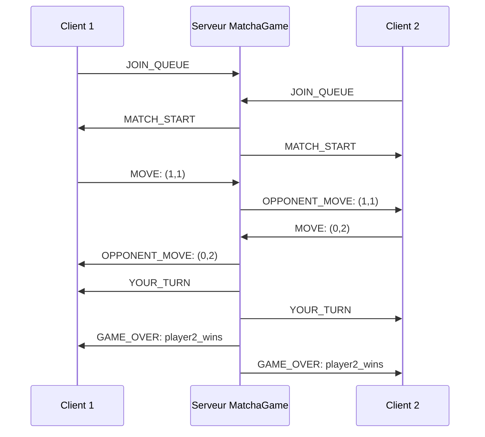

# Echange client-serveur

Voici un exemple (résumé et illustré) des échanges réalisés entre le(s) client(s) et le serveur

## Résumé :

1. Client 1 et Client 2 envoient JOIN_QUEUE

2. Serveur répond à chacun avec MATCH_START dès qu’une paire est formée

3. Le jeu commence :

    - Client 1 joue MOVE: (1,1)

    - Serveur transmet à Client 2 : OPPONENT_MOVE: (1,1)

    - Client 2 joue à son tour : MOVE: (0,2)

    - Serveur transmet à Client 1 : OPPONENT_MOVE: (0,2)

4. Serveur informe chacun quand c’est leur tour avec YOUR_TURN

5. À la fin : ``GAME_OVER: player2_wins envoyé aux deux joueurs (ou player1_wins, c'est juste un exemple)``

## Schéma :
